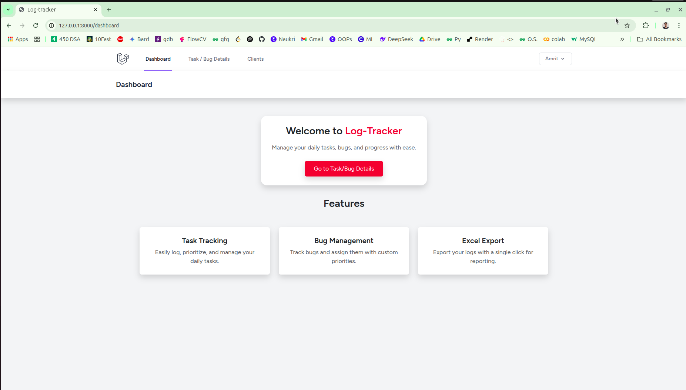

# 📝 Log Tracker – Laravel Task & Bug Management Tool

A simple Laravel-based task and bug tracking application built to help manage day-to-day work logs, priorities, clients, deadlines, and comments—all in one place.

## 🚀 Features

- Task & Bug logging with details
- Priority, Status, and Date tracking
- Client management
- Comments on tasks
- AJAX-based Select2 dropdowns for Task Name and Client selection
- Rich Text Editor (Trix Editor)
- Tabulator integration for advanced table filtering, sorting, and export
- Export tasks to XLXS
- Authentication using Laravel Breeze

## 🛠️ Tech Stack

- Laravel 11 (PHP Framework)
- MariaDB / MySQL
- Trix Editor (Rich text editor)
- Tabulator (Data tables)
- Select2 (Auto-suggestions)
- Bootstrap 5 (UI Framework)

## 📂 Project Structure

      log-tracker/
      ├── app/
      ├── bootstrap/
      ├── config/
      ├── database/
      │   ├── migrations/
      │   └── seeders/
      ├── public/
      │   └── uploads/
      ├── resources/
      │   ├── views/
      │   └── js/
      ├── routes/
      │   └── web.php
      ├── storage/
      ├── .env
      ├── composer.json
      └── package.json

## ⚙️ Setup Instructions

1. **Clone the Repository**
   ```bash
   git clone https://github.com/your-username/log-tracker.git
   cd log-tracker
   
## Install Dependencies

2. **composer install**
   ```bash
   npm install && npm run dev

3. **Set Up Environment**
  - Copy the example environment file and update DB credentials.
     ```bash
    cp .env.example .env
    php artisan key:generate

4. **Configure Database**
  - Update .env with your local MariaDB/MySQL credentials.

5. **Run Migrations**
     ```bash
    php artisan migrate
  
 -  (Optional) Seed Sample Data
       ```bash
      php artisan db:seed

6. **Start the Application**
     ```bash
    php artisan serve

7. **Login/Registration**
  - Laravel Breeze provides built-in authentication. Register a new user or login using existing credentials.

## 📸 Screenshots



## ⚡ Optimization Tips
**Before deploying to production, run:**
     ```bash
     Running php artisan config:cache
     php artisan route:cache
     npm run build for optimization

## 📌 Future Enhancements
- Add user roles (Admin, Manager, Developer)
- Task reminders/notifications
- Drag-and-drop prioritization
- Export to PDF

## 🙌 Credits
- Laravel
- Tabulator
- Trix Editor
- Select2
- Bootstrap, Font Awesome, etc.

## 📝 License
This project is open-source and available under the MIT License.
